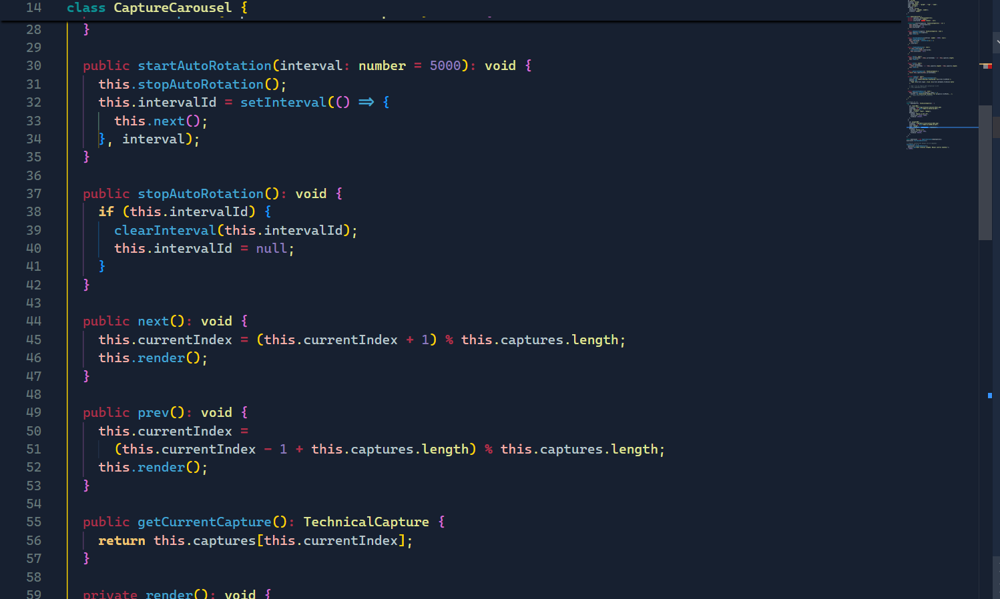
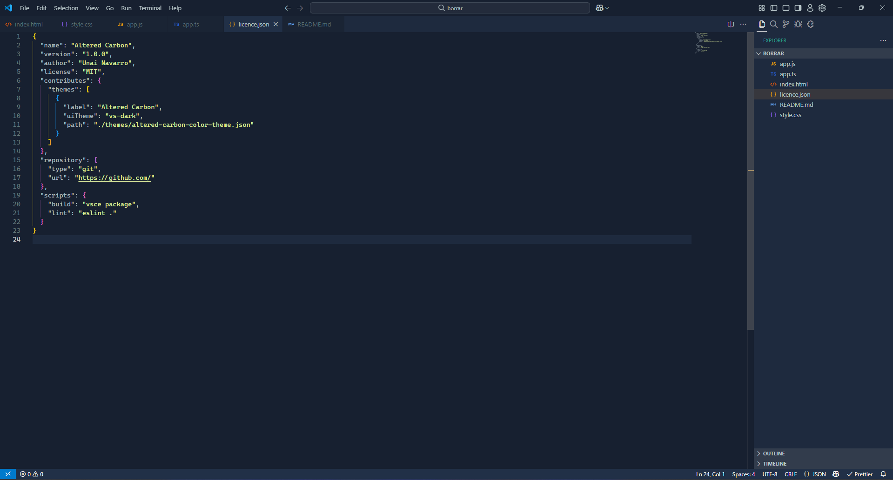
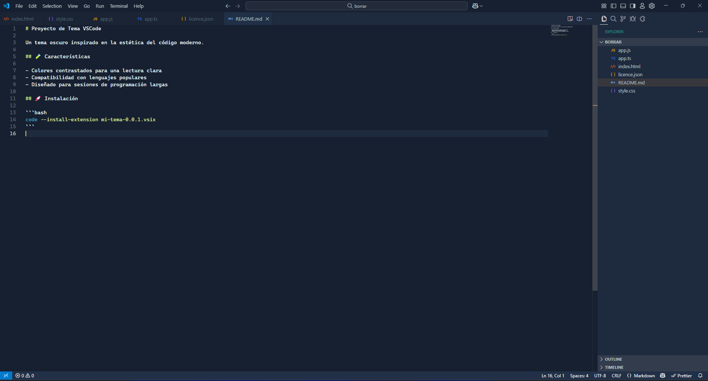

<h1 align = "center">Altered Carbon Theme🎨</h1>

Altered Carbon es un tema oscuro para Visual Studio Code inspirado en el elegante y minimalista esquema de colores del tema Carbon de IntelliJ IDEA. Su objetivo es ofrecer una experiencia de desarrollo limpia, moderna y agradable a la vista, con una paleta de colores sobria y contrastes suaves que no cansan la vista.

## Galería

<table>
  <tr>
    <td></td>
    <td></td>
  </tr>
  <tr>
    <td></td>
    <td></td>
  </tr>
  <tr>
    <td></td>
    <td></td>
  </tr>
</table>

## Instalación

1. Descarga el archivo `.vsix` ➡️ [Altered Carbon](https://github.com/unai-navarro/altered-carbon-theme/blob/main/public/assets/altered-carbon-0.0.1.vsix).
2. Abre VSCode.
3. Presiona `Ctrl+Shift+P` y escribe: `Extensions: Install from VSIX...`.
4. Selecciona el archivo descargado.
5. Aplica el tema desde `Preferences: Color Theme`.